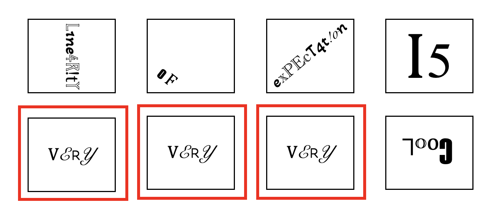

### **Motivation**

Powered by repeated innovations in chip manufacturing,
computers have grown exponentially more powerful over the last several decades.
As a result, we have access to unparalleled computational resources and data.
For example, NASA collects 6.4 terabytes of satellite images (check),
X institute sequences 24 terabytes of genomic data (check), and
Google receives X search queries (check) *every single day*.
Simultaneously, we are quickly approaching the physical limit 
of how many transistors can be packed on a single chip.
In order to learn from the data we have and continue expanding our
computational abilities into the future,
fast and efficient algorithms are more important than ever.

At first glance, an algorithm that performs only a few operations per item
in our data set is efficient.
However, these algorithms can be too slow when we have lots and lots of data.
Instead, we turn to randomized algorithms that can run even faster.
Randomized algorithms typically exploit some source of randomness to run
on only a small part of the data set (or use only a small amount of space)
while still returning an *approximately* correct result.

We can run randomized algorithms in practice to see how well they work.
But we also want to *prove* that they work and understand why.
We will use probability tools to analyze the behavior of randomized algorithms.
Today, our goal is to see how we can build a powerful algorithm using 
only simple probability tools.

### Probability Background

Consider a random variable $X$.
For example, $X$ could be the outcome of a fair dice roll
and be equal to $1,2,3,4,5$ or $6$, each with probability $\frac{1}{6}$.
Formally, we use $\Pr(X=x)$ to represent the probability
that the random variable $X$ is equal to the outcome $x$.
The expected value of a discrete random variable is
$$
\mathbb{E}[X] = \sum_{x} x \Pr(X=x).
$$
For example, the expected outcome of the fair dice roll is
$\mathbb{E}[X] = 1 \times \frac{1}{6} + 2 \times \frac{1}{6} + 3 \times \frac{1}{6} +
4 \times \frac{1}{6} + 5 \times \frac{1}{6} + 6 \times \frac{1}{6} = \frac{21}{6}$.
If the random variable is continuous, we can similarly define its expected value
using an integral.

The expected value tells us where the random variable is on average but
we're also interested in how closely the random variable concentrates
around its expectation.
The variance of a random variable is
$$
\textrm{Var}[X] = \mathbb{E}\left[(X - \mathbb{E}[X])^2\right].
$$
Notice that the variance is larger when the random variable 
is often far from its expectation.
In the figure below, can you identify the expected value for
each of the three distributions? Which distribution has the largest variance?
Which has the smallest?

There are a number of useful facts about the expected value and variance.
For example, 

$$
\mathbb{E}[\alpha X] = \alpha \mathbb{E}[X]
\hspace{1em} \textrm{and} \hspace{1em}
\textrm{Var}(\alpha X) = \alpha^2 \textrm{Var}(X)
$$
where $\alpha \in \mathbb{R}$ is a real number.
Using the definitions of expectated value and variance,
can you prove to yourself why both equations hold?

Once we have defined random variables, we are often interested in events
defined on the outcome space.
Let $A$ and $B$ be two events.
For example, $A$ could be the event that the dice shows $1$ or $2$ while
$B$ could be the event that the dice shows an odd number.
We use $\Pr(A \cap B)$ to denote the probability that events $A$ and $B$ both happen.
Often, we have information about one event and want to see how that
changes the probability of another event.
We use $\Pr(A | B)$ to denote the conditional probability of event $A$ 
given that $B$ happened.
We define

$$
\Pr(A | B) = \frac{\Pr(A \cap B)}{\Pr(B)}.
$$

If information about event $B$ does not give us information about event $A$,
we say that $A$ and $B$ are independent.
Formally, events $A$ and $B$ are independent if $\Pr(A|B) = \Pr(A)$.
By the definition of conditional probability, an equivalent definition
of independence is $\Pr(A \cap B) = \Pr(A) \Pr(B)$.

Let's figure out whether the event $A$ that the dice shows 1 or 2
is independent of the event $B$ that the dice shows an odd number.
Well, $\Pr(A \cap B) = \frac{1}{6}$ since the only outcome that satisfy
both events is when the dice shows a 1.
We also know that $\Pr(A) \Pr(B) = \frac{2}{6} \times \frac{3}{6} = \frac{1}{6}$.
So, by the second definition of independence, we can conclude that
$A$ and $B$ are independent.

We've been talking about events defined on random variables, but we'll
also be interested in when random variables are independent.
Consider random variables $X$ and $Y$.
We say that $X$ and $Y$ are independent if, for all outcomes $x$ and $y$,
$\Pr(X=x \cap Y=y) = \Pr(X=x) \Pr(Y=y)$.

### Linearity of Expectation
One of the most powerful theorems in all of probability is the linearity
of expectation.
Let $X$ and $Y$ be random variables.
Then the theorem states that
$$
\mathbb{E}[X+Y] = \mathbb{E}[X] + \mathbb{E}[Y].
$$
The result is a powerful tool that requires *no assumptions* on the random
variables.

There are also several other useful facts about the expected value and variance.
Can you figure out whether the following equations are always true?
Or, if not, what assumptions they require?

* $\mathbb{E}[XY] = \mathbb{E}[X] \mathbb{E}[Y]$

* $\textrm{Var}(X+Y) = \textrm{Var}(X) + \textrm{Var}(Y)$

* $\textrm{Var}(X) = \mathbb{E}[X^2] - \mathbb{E}[X]^2$

### Set Size Estimation
We'll pose a problem that has applications in ecology, social networks,
and internet indexing.
However, while efficiently solving the problem is useful, 
our purpose is really to gain familiarity with linearity of expectation.

Suppose you run a website that is considering contracting with
a company to provide CAPTCHAs for login verification.
The company claims to have a database with $n=1,000,000$ unique CAPTCHAs.
For each API call, they'll return a CAPTCHA chosen uniformly at random
from their database.
Here's our problem:
How many queries $m$ do we need to make to their API until we can
independently verify that they have a million CAPTCHAs?

An obvious approach is to keep calling ther API until we find a million
unique CAPTCHAs.
Of course, the problem is that we have to make at least a million API calls.
That's a problem if we care about efficiency, they charge us per call,
or the size of they claim to have in their database is much bigger than a million.

A second, more clever approach is to call their API and count duplicates.
Intuitively, the larger their database, the fewer duplicates we expect to see.
Define a random variable $D_{i,j}$ which is 1 if the 
$i$th and $j$th calls return the same CAPTCHA and 0 otherwise.
(To avoid double counting, we'll assume $i < j$.)
For example, in the example below, the $5$th, $6$th, and $7$th calls
returned the same CAPTCHA so $D_{5,6}$, $D_{5,7}$, and $D_{6,7}$ are all 1.

When a random variable can only be 0 or 1, we call it an
*indicator* random variable.
Indicator random variables have the special property that their
expected value is the probability they are 1.
We can define the total number of duplicates $D$ in terms of
our indicator random variables $D_{i,j}$.

$$
D = \sum_{\substack{i, j \in \{1, \ldots, m\} \\ i < j }} D_{i,j}
$$

We can calculate the expected number of duplicates using linearity of expectation.

$$
\mathbb{E}[D] = \sum_{\substack{i, j \in \{1, \ldots, m\} \\ i < j }} \mathbb{E}[D_{i,j}]
$$

Since $D_{i,j}$ is an indicator random variable, we know
$\mathbb{E}[D_{i,j}]$ is the probability the $i$th and $j$th CAPTCHA are the same.
Since each API call is a uniform and independent sample from the database,
the probability the $j$th CAPTCHA is the same as the $i$th is $\frac{1}{n}$.
With this observation in hand, 

$$
\mathbb{E}[D] = \sum_{\substack{i, j \in \{1, \ldots, m\} \\ i < j }} \frac{1}{n}
= \binom{m}{2} \frac{1}{n} = \frac{m(m-1)}{2n}.
$$

