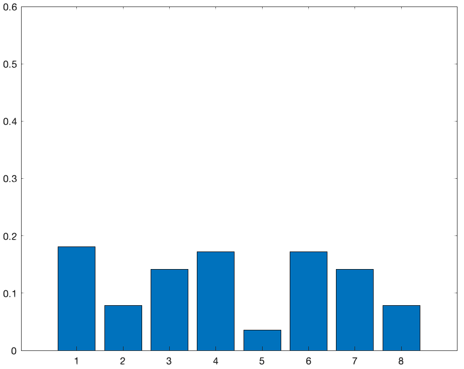
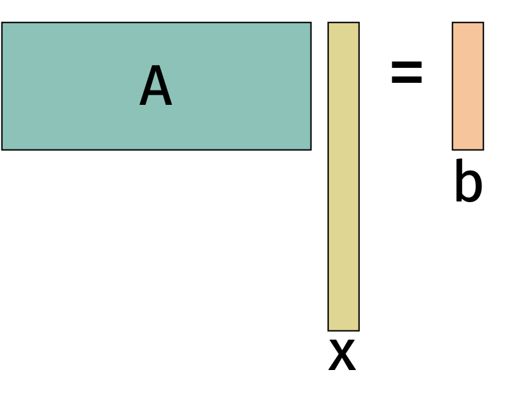
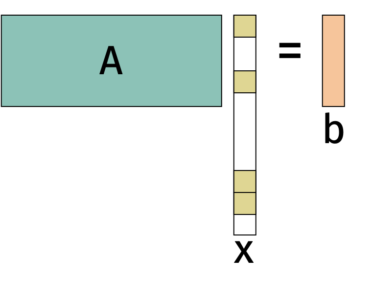
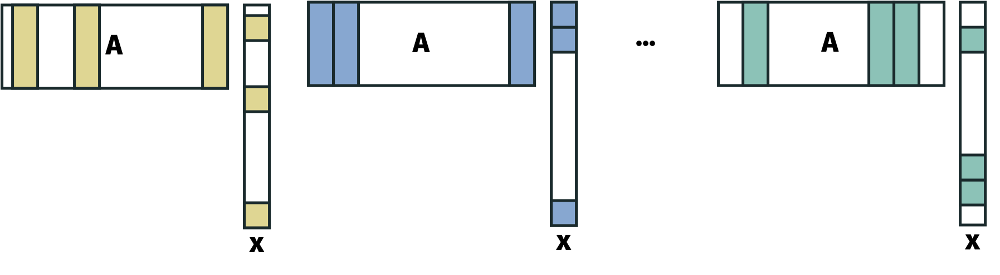

The Hadamard transform is closely related to the Discrete Fourier Transform $\mathbf{F} \in \mathbb{C}^{n \times n}$.
The DFT is defined on complex numbers
$$
\mathbf{F}_{j,k} = e^{-2\pi i \frac{j k}{n}}
$$
where $i$ is the imaginary unit.
The DFT is a unitary matrix so $\mathbf{F}^* \mathbf{F} = \mathbf{I}$ where $\mathbf{F}^*$ is the conjugate transpose of $\mathbf{F}$.

Using the same divide-and-conquer algorithm as the Hadamard matrix, we can compute $\mathbf{Fy}$ the DFT of the vector $\mathbf{y}$ in $O(n \log n)$ time.

The real part of the $j,k$ entry is $\cos(2\pi j k)$ so the $j$th row of $\mathbf{F}$ looks like a cosine wave with frequency $j$.
Computing $\mathbf{Fy}$ computes inner products of $\mathbf{y}$ with many different frequencies, which can be used to decompose the vector into a sum of those frequencies.

The figure hints at the intuition behind the uncertainty principle: a vector and its DFT cannot both be concentrated.

As we saw before, sampling does not preserve norms when $\mathbf{y}$ has a few large entries.
Taking the Fourier transform, just like taking the Hadamard transform, eliminates the hard case without changing the norm.
Because of this property, the Fourier transform is one of the central tools in sparse recovery (also sometimes called compressed sensing).

The goal in sparse recover is to recover a vector $\mathbf{x}$ from linear measurements.
We can choose $\mathbf{A} \in \mathbb{R}^{m \times n}$ with $m < n$.
Assume we can access the *measurement* $\mathbf{b} = \mathbf{Ax}$.
We will try to recover $\mathbf{x}$ from $\mathbf{b}$.

Since $m < n$, there are infinitely many vectors $\mathbf{x}$ that satisfy $\mathbf{Ax} = \mathbf{b}$.

However, we can hope to recover $\mathbf{x}$ if we know that $\mathbf{x}$ has some additional structure.

We'll consider an example in photography.
Typically, cameras acquire images by measuring the intensity of light with one sensor per pixel.

We could instead imagine a camera that measures the intensity of light with just one sensor.

If the pixel intensities are $\mathbf{x} \in \mathbb{R}^n$, then the single pixel returns
$$
b = \frac1{n} \sum_{i=1}^n x_i 
= \begin{bmatrix} \frac1{n} & \frac1{n} & \cdots & \frac1{n} \end{bmatrix} \mathbf{x}
\begin{bmatrix} x_1 \\ x_2 \\ \vdots \\ x_n \end{bmatrix}
$$
which is not very much information about the image.
But we can get more information from other linear measurements via masking.

Let
$$
b_i = \frac1{n} \sum_{j \in S_i} x_j
= \begin{bmatrix} 0 & \frac1{n} & \cdots & 0 \end{bmatrix} \begin{bmatrix} x_1 \\ x_2 \\ \vdots \\ x_n \end{bmatrix}.
$$
If we take enough measurements $b_i$, then we can recover the whole image.

There are applications of this approach in imaging outside of the visible spectrum, microscopy, and other scientific imaging.
The theory we will discuss does not exactly describe these problems but it has been very valuable in modeling them.

We will make an assumption to solve the problem.
In particular, we will assume that $\mathbf{x}$ is $k$-sparse for small $k$ i.e., $\| \mathbf{x} \|_0 \leq k$.
In many cases, we can recover $\mathbf{x}$ with roughly $O(k)$ measurements.

It is natural to ask whether sparsity is a reasonable assumption.
For some of the approaches we will discuss, it suffices to assume that $\mathbf{x}$ is sparse in any known basis.
For example, images tend to have repeating patterns which can be sparse in the Fourier basis.
In fact, JPEG compression is based on this idea.

Even under this assumption, there are some matrices $\mathbf{A}$ that will not allow us to recover $\mathbf{x}$.
For example, if $\mathbf{A}$ has repeated columns then we cannot distinguish between the entries of $\mathbf{x}$ that correspond to those columns.

There are several ways to formalize the property that $\mathbf{A}$ allows us to recover $\mathbf{x}$:

* $\mathbf{A}$ has Kruskal rank $r$ if all sets of $r$ columns are linearly independent.

* $\mathbf{A}$ is $\mu$-incoherent if $|\mathbf{A}_{i}^\top \mathbf{A}_j | \leq \mu \|\mathbf{A}_i \|_2 \| \mathbf{A}_j \|_2$ for all distinct columns $i,j$.

Today, we will consider matrices that satisfy the RIP.

**Restricted Isometry Property (RIP):**
$\mathbf{A}$ satisfies the $(q,\epsilon)$-Restricted Isometry Property (RIP) if $(1-\epsilon) \| \mathbf{x} \|_2^2 \leq \| \mathbf{Ax} \|_2^2 \leq (1+\epsilon) \| \mathbf{x} \|_2^2$ for all $q$-sparse vectors $\mathbf{x}$.

Notice that RIP is a Johnson-Lindenstrauss type condition.
A matrix $\mathbf{A}$ that is $(q, \epsilon)$-RIP preserves the norm of all $q$-sparse vectors as opposed to the norms of a discrete set of vectors or all vectors in a subspace (as in subspace embeddings).

Matrices that are satisfy RIP are not too rare, random Johnson-Lindenstrauss matrices (e.g., Gaussian, sign) with $m=O\left(\frac{k \log(n/k}{\epsilon^2}\right)$ rows are $(k, \epsilon)$-RIP.

**$\ell_0$-Minimization Theorem:**
Suppose we are given $\mathbf{A} \in \mathbb{R}^{m \times n}$ and $\mathbf{b} = \mathbf{Ax}$ for an unknown $k$-sparse $\mathbf{x} \in \mathbb{R}^n$.
If $\mathbf{A}$ is $(2k,\epsilon)$-RIP for any $\epsilon< 1$, then $\mathbf{x}$ is the unique minimizer of
$$
\min_{\mathbf{z} \in \mathbb{R}^n} \| \mathbf{z} \|_0 \quad \textrm{subject to} \quad \mathbf{Az} = \mathbf{b}.
$$

The theorem establishes that *information theoretically* we can recover $\mathbf{x}$ from $\mathbf{b}$.
However, solving the $\ell_0$-minimization problem is computationally difficult, requiring $O(n^k)$ time.
We will address a faster method shortly.

**Proof:**
By contradiction, assume there is some $\mathbf{y} \neq \mathbf{x}$ with $\mathbf{Ay} = \mathbf{b}$ and $\| \mathbf{y} \|_0 \leq \| \mathbf{x} \|_0$.

We know that
\begin{align*}
\mathbf{A}(\mathbf{y} - \mathbf{x}) =
\mathbf{Ay} - \mathbf{Ax} 
= \mathbf{b} - \mathbf{b} = 0
\end{align*}
so 
$\| \mathbf{A(y-x)} \|_2 = 0$.
But $\mathbf{y-x}$ is $2k$-sparse and $\mathbf{A}$ is $(2k,\epsilon)$-RIP so
\begin{align*}
(1-\epsilon) \| \mathbf{y-x} \|_2^2 \leq \| \mathbf{A(y-x)} \|_2^2 \leq (1+\epsilon) \| \mathbf{y-x} \|_2^2
\end{align*}
but this is a contradiction since $\| \mathbf{y-x}\|_2 > 0$ and $\| \mathbf{A(y-x)}\|_2 = 0$

There are robust versions of the $\ell_0$-minimization theorem.
These are more important in practice because they are more stable to noise.
Here's a flavor of the results:
Suppose $\mathbf{b} = \mathbf{A}(\mathbf{x} + \mathbf{e})$ where $\mathbf{x}$ is $k$-sparse $\mathbf{e}$ is dense but has bounded norm.
Then we can recover some $k$-sparse $\tilde{\mathbf{x}}$ such that $$\| \mathbf{x} - \tilde{\mathbf{x}} \|_2 \leq \|\mathbf{e}\|_2.$$

We will not discuss robustness in detail.
But, along with computational considerations, it is a big part of what has made compressed sensing such an active research area in the last two decades.
There are non-robust compressed sensing results that have been known for a long time.
For example, compressed sensing was discussed in the 1795 paper by Gaspard Riche de Prony titled *Essai experimental et analytique: sur les lois de la dilatabilite des fluides elastique et sur celles de la force expansive de la vapeur de l'eau et de la vapeur de l'alkool, a differentes temperatures.*

In many applications, we can compute measures of the form $\mathbf{Ax} = \mathbf{SFx}$ where $\mathbf{F}$ is the DFT matrix and $\mathbf{S}$ is a subsampling matrix.
Recall that $\mathbf{F}$ decomposes $\mathbf{x}$ into different frequencies which tends to be sparse depending on the application.
Then $\mathbf{Ax}$ is a subset of rows from $\mathbf{F}$ then $\mathbf{Ax}$ is a subset of random frequency components from the DFT of $\mathbf{x}$.
In many scientific applications, we can collect entries of $\mathbf{Fx}$ one at a time for some unobserved data vector $\mathbf{x}$.

**Medical Imaging (MRI):**
How do we measure entries of the Fourier transform $\mathbf{Fx}$ for an MRI? We blast the body with sound waves of varying frequency.
If we can reduce the number of measurements, we can reduce the time the patient spends in the machine and the energy use of the procedure.

**Geophysics:**
How do we measure entries of the Fourier transform $\mathbf{Fx}$ for geophysical analysis? We blast the ground with sound waves of varying frequency (e.g.,using airguns, controlled explosions, and vibrations from drilling).
If we can reduce the number of measurements, we can make the data acquisition process cheaper and less disruptive.

Setting $\mathbf{A}$ to contain $m=\left( \frac{k \log^2 k \log n}{\epsilon^2} \right)$ random rows of a discrete Fourier matrix $\mathbf{F}$ yields a matrix that satisfies $(k, \epsilon)$-RIP with high probability.
In spirit, the proof requires similar tools to analyze subsampled Hadamard transforms!
Many brilliant mathematicians have worked on this problem including Guruswami, Bourgain, Veryshinin, and Tao.

Amazing, we can actually prove a version of this result with slightly worse bound.
We'll start with the observation
that the $k$-sparse vectors $\mathbf{x}$ that can be written as $\mathbf{Ax}$ lie in a union of $k$-dimensional subspaces.

**Theorem (from Subspace Embedding):**
Let $\mathcal{U} \subset \mathbb{R}^n$ be a $k$-dimensional linear subspace.
If $\mathbf{\Pi} \in \mathbb{R}^{m \times n}$ is chosen from any distribution $\mathcal{D}$ satisfying the distributional JL lemma, then with probability $1-\delta$,
$$
(1-\epsilon) \| \mathbf{x} \|_2^2 \leq \| \mathbf{\Pi x} \|_2^2 \leq (1+\epsilon) \| \mathbf{x} \|_2^2
$$
for all $\mathbf{x} \in \mathcal{U}$ as long as
$m = O\left( \frac{k\log(n) + \log(1/\delta)}{\epsilon^2} \right)$.

**Proof:**
We will prove the result by applying the subspace embedding theorem with $\delta' = \delta/\# \text{subspaces}$.
Then, by union bound, we have that the result holds for all subspaces with probability $1-\delta$.
There are $n \choose k$ possible $k$-dimensional subspaces.
We can use the very loose bound that
\begin{align*}
\binom{n}{k}
= \frac{n!}{k!(n-k)!}
\leq n^k.
\end{align*}
We set $\delta' = \delta/n^k$ so
\begin{align*}
\log \left( \frac{1}{\delta'} \right)
= \log \left( \frac1{\delta} \right)
+ k \log \left( n \right).
\end{align*}
Applying the subspace embedding theorem gives that we need 
\begin{align*}
m = O\left( \frac{k + \log(1/\delta')}{\epsilon^2} \right)
= O\left( \frac{k + k \log(n) + \log(1/\delta)}{\epsilon^2} \right).
\end{align*}

